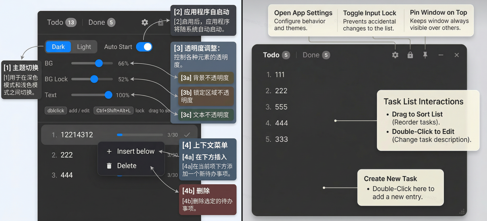

# StickyTodo

A lightweight, always-on-top desktop sticky note for your TODOs.

轻量级桌面置顶便签 TODO 应用。

## Download / 下载

Go to [Releases](https://github.com/lanson-dev/StickyTodo/releases) to download / 前往 Releases 页面下载：

| Platform | File |
|---|---|
| Windows x64 | `StickyTodo_1.3.0_x64-setup.exe` |
| macOS Apple Silicon | `StickyTodo_1.3.0_aarch64.dmg` |
| macOS Intel | `StickyTodo_1.3.0_x64.dmg` |
| Linux x64 | `StickyTodo_1.3.0_amd64.deb` / `.AppImage` |

## How to Use / 使用说明



- **Add task / 添加任务**：Double-click blank area or right-click → Add task / 双击空白区域或右键 → Add task
- **Edit task / 编辑任务**：Double-click a task / 双击任务条目
- **Insert task / 插入任务**：Right-click a task → Insert below / 右键任务 → Insert below
- **Delete task / 删除任务**：Right-click a task → Delete / 右键任务 → Delete
- **Complete task / 完成任务**：Hover and click ✓ / 悬浮点击 ✓
- **Reorder / 拖拽排序**：Drag tasks up or down / 拖拽任务上下移动
- **Pin on top / 置顶**：Click 📌 button / 点击图钉按钮
- **Lock / 锁定穿透**：Click 🔒 button or `Ctrl+Shift+Alt+L` / 点击锁按钮或快捷键
- **System tray / 系统托盘**：Right-click tray icon → Lock / Stick / Quit

## Features / 功能

- 📌 Pin on top / Lock (click-through) mode — 置顶 / 锁定（点击穿透）模式
- 🎨 Glassmorphism UI with adjustable opacity — 毛玻璃 UI，可调节透明度
- 🔄 Drag-and-drop task reordering — 拖拽排序
- ✅ Done items grouped by date — 已完成条目按日期分组
- 🖥️ System tray with right-click menu — 系统托盘右键菜单
- 🚀 Auto-start on boot — 开机自启
- ⌨️ `Ctrl+Shift+Alt+L` global shortcut to toggle lock — 全局快捷键切换锁定

## Dev / 开发

Built with / 技术栈：**Vue 3** + **TypeScript** + **Tauri 2**

```sh
cd StickyTodo
npm install
npm run tauri dev
```

## Build / 构建

```sh
npm run tauri build
```

Output / 产物位于 `src-tauri/target/release/`

## Data / 数据存储

`C:\Users\<USER>\AppData\Roaming\com.stickytodo.app\`

| File / 文件     | Content / 内容   |
| --------------- | ---------------- |
| `todos.json`  | Tasks / 任务数据 |
| `config.json` | Settings / 配置  |

## Links / 链接

- GitHub: [https://github.com/lanson-dev/StickyTodo](https://github.com/lanson-dev/StickyTodo)
- Releases: [https://github.com/lanson-dev/StickyTodo/releases](https://github.com/lanson-dev/StickyTodo/releases)

## License

MIT